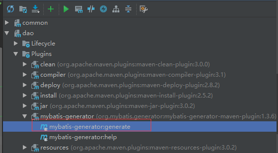
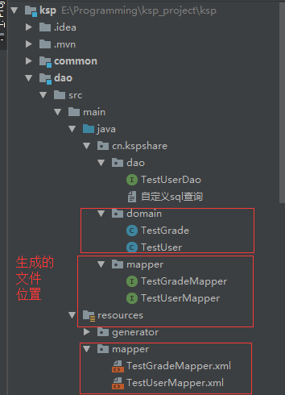

# kspshare 坎巴拉分享站

@toc

## 一、后台搭建过程
### 1.1 开发环境
* Spring Boot 2.x
* Mybatis + 通用 Mapper4 + PageHelper
* swagger2
* 开发工具IntelliJ IDEA 2018
* 数据库mysql 5.7

### 1.2 初始化spring boot项目
创建一个空maven项目，
在项目根目录下创建三个模块分别为**web**、**dao**、**common**。
创建web模块时 选择`Spring Initializr` ，在Initial Service Url 中输入`https://start.spring.io`
_详情参考：http://www.spring4all.com/article/247_

### 1.3 项目基本目录结构
```java
ksp
  common
  dao
    java
      cn.kspshare.dao
      cn.kspshare.domain
      cn.kspshare.mapper
    resources
      generator
      mapper
  web
    java
      cn.kspshare.config
      cn.kspshare.controller
      cn.kspshare.service
      cn.kspshare.dto
      cn.kspshare.WebApplicatioin.java
    resources
      application.yml
```

###    1.4 整合Mybatis
```html
<!-- 位置：root根模块 -> pom.xml -->

<!-- Spring Boot Mybatis 依赖 -->
<dependency>
    <groupId>org.mybatis.spring.boot</groupId>
    <artifactId>mybatis-spring-boot-starter</artifactId>
    <version>1.2.0</version>
</dependency>
<!-- MySQL 连接驱动依赖 -->
<dependency>
    <groupId>mysql</groupId>
    <artifactId>mysql-connector-java</artifactId>
    <version>5.1.39</version>
</dependency>
```

```java
# 位置：web模块 -> resources -> application.yml

## 数据源配置
spring:
  datasource:
    url: jdbc:mysql://localhost:3306/springbootdb?useSSL=false&useUnicode=true&characterEncoding=utf8
    username: root
    password: root
    driver-class-name: com.mysql.jdbc.Driver
## mybatis配置
mybatis:
  typeAliasesPackage: cn.kspshare.domain #实体类包路径
  mapperLocations: classpath:mapper/*.xml

#SQL打印 level下面指定mybatis对应的方法接口所在的包
logging:
  level:
     cn.kspshare.dao : debug
     cn.kspshare.mapper : debug
```

启动类添加注解 扫描mapper接口所在位置
`@MapperScan({"cn.kspshare.mapper","cn.kspshare.dao"})`
_详情参考：http://www.spring4all.com/article/145  运行 springboot-mybatis 工程_

### 1.5 整合通用Mapper4 + Mybatis-Generator
```html
<!-- 位置：dao模块 -> pom.xml -->

<!--通用mapper集成-->
<dependencies>
  //...  
  <dependency>
      <groupId>tk.mybatis</groupId>
      <artifactId>mapper-spring-boot-starter</artifactId>
      <version>4.0.0</version>
  </dependency>
</dependencies>
<build>
    <plugins>
        <!--Mybatis实体自动生成-->
        <plugin>
            <groupId>org.mybatis.generator</groupId>
            <artifactId>mybatis-generator-maven-plugin</artifactId>
            <version>1.3.6</version>
            <configuration>
                <overwrite>true</overwrite>
                <verbose>true</verbose>
                <configurationFile>${basedir}/src/main/resources/generator/generatorConfig.xml</configurationFile>
            </configuration>
            <dependencies>
                <dependency>
                    <groupId>mysql</groupId>
                    <artifactId>mysql-connector-java</artifactId>
                    <version>5.1.39</version>
                </dependency>
                <dependency>
                    <groupId>tk.mybatis</groupId>
                    <artifactId>mapper</artifactId>
                    <version>4.0.0</version>
                </dependency>
            </dependencies>
        </plugin>
    </plugins>
</build>
```

```
# 位置 dao模块 -> resources -> generator.properties

# mybatis-generator生成实体数据库驱动
jdbc.driverClass = com.mysql.jdbc.Driver
jdbc.url = jdbc:mysql://localhost:3306/springbootdb?useSSL=false&useUnicode=true&characterEncoding=utf8
jdbc.user = root
jdbc.password = root
```

```html
<!-- 位置 dao模块 -> resources -> generatorConfig.xml -->

<?xml version="1.0" encoding="UTF-8"?>
<!DOCTYPE generatorConfiguration
        PUBLIC "-//mybatis.org//DTD MyBatis Generator Configuration 1.0//EN"
        "http://mybatis.org/dtd/mybatis-generator-config_1_0.dtd">

<generatorConfiguration>
    <properties resource="generator/generator.properties" />

    <context id="Mysql" targetRuntime="MyBatis3Simple" defaultModelType="flat">
        <property name="beginningDelimiter" value="`" />
        <property name="endingDelimiter" value="`" />
        <!--配置是否使用通用 Mapper 自带的注释扩展，默认 true-->
        <!--<property name="useMapperCommentGenerator" value="false"/>-->

        <!--通用 Mapper 插件，可以生成带注解的实体类-->
        <plugin type="tk.mybatis.mapper.generator.MapperPlugin">
            <property name="mappers" value="tk.mybatis.mapper.common.Mapper" />
            <property name="caseSensitive" value="true" />
        </plugin>

        <jdbcConnection driverClass="${jdbc.driverClass}" connectionURL="${jdbc.url}" userId="${jdbc.user}" password="${jdbc.password}">
        </jdbcConnection>

        <!--MyBatis 生成器只需要生成 Model-->
        <javaModelGenerator targetPackage="cn.kspshare.domain" targetProject="src/main/java" />

        <sqlMapGenerator targetPackage="mapper" targetProject="src/main/resources" />

        <javaClientGenerator targetPackage="cn.kspshare.mapper" targetProject="src/main/java" type="XMLMAPPER" />

        <table tableName="test_%">
            <!--<generatedKey column="tbId" sqlStatement="JDBC"/>-->
        </table>
        <!--<table tableName="test_%">-->
        <!--&lt;!&ndash;原样匹配数据库字段，不使用驼峰&ndash;&gt;-->
        <!--<property name="useActualColumnNames" value="true"/>-->
        <!--</table>-->
    </context>
</generatorConfiguration>
```
运行maven插件，反向生成实体类、mapper接口、实体xml




```java
//多条件查询用法 基于java8书写方式
Example example = new Example.Builder(TestUser.class).andWhere(WeekendSqls.<TestUser>custom()
      .andGreaterThan(TestUser::getAge, 20)
      .andLessThan(TestUser::getAge, 40))
      .build();
```

```java
//新增
@Override
@Transactional
public Object saveUser(TestUserDto userDto) {
    TestUser user = new TestUser();
    user.setTid(IDGenerator.id());
    user.setUserName(userDto.getUserName());
    user.setAge(userDto.getAge());
    user.setGradeId(userDto.getGradeId());
    userMapper.insertSelective(user);
    return "success";
}
```

_使用方法及文档：https://github.com/abel533/Mapper/wiki_

### 1.6 集成PageHelper
```html
<!-- 位置：根模块->pom.xml -->

<!--分页插件-->
<dependency>
    <groupId>com.github.pagehelper</groupId>
    <artifactId>pagehelper-spring-boot-starter</artifactId>
    <version>1.2.10</version>
</dependency>
```
_使用方法及文档：https://github.com/pagehelper/Mybatis-PageHelper/blob/master/wikis/zh/HowToUse.md_

### 1.7 整合swagger2
```html
<!-- 位置：根模块->pom.xml -->

<!--添加Swagger2依赖-->
<dependency>
    <groupId>io.springfox</groupId>
    <artifactId>springfox-swagger2</artifactId>
    <version>2.2.2</version>
</dependency>
<dependency>
    <groupId>io.springfox</groupId>
    <artifactId>springfox-swagger-ui</artifactId>
    <version>2.2.2</version>
</dependency>
```
 

```java
//位置：web模块->cn.kspshare.config.Swagger2

package cn.kspshare.config;   
import org.springframework.context.annotation.Bean; 
import org.springframework.context.annotation.Configuration; 
import springfox.documentation.builders.ApiInfoBuilder; 
import springfox.documentation.builders.PathSelectors; 
import springfox.documentation.builders.RequestHandlerSelectors; 
import springfox.documentation.service.ApiInfo; 
import springfox.documentation.spi.DocumentationType; 
import springfox.documentation.spring.web.plugins.Docket; 
import springfox.documentation.swagger2.annotations.EnableSwagger2;   
/**
 * 【swagger配置，项目启动后访问http://localhost:8080/swagger-ui.html 即可查看API文档】
  * 通过@Configuration注解，让Spring来加载该类配置。
  * 再通过@EnableSwagger2注解来启用Swagger2。
  * <p>
  * 通过createRestApi函数创建Docket的Bean之后，apiInfo()用来创建该Api的基本信息（这些基本信息会展现在文档页面中）。
  * select()函数返回一个ApiSelectorBuilder实例用来控制哪些接口暴露给Swagger来展现，
  * 本例采用指定扫描的包路径来定义，Swagger会扫描该包下所有Controller定义的API，并产生文档内容（除了被@ApiIgnore指定的请求）。
  * <p>
  * Create by CMC(chao_c_c@163.com) 2018/5/27 14:50
 */ 
 @Configuration 
 @EnableSwagger2 
 public class Swagger2 {

    @Bean
    public Docket createRestApi() {
          return new Docket(DocumentationType.SWAGGER_2)
                  .apiInfo(apiInfo())
                  .select()
                  .apis(RequestHandlerSelectors.basePackage("cn.kspshare.controller"))
                  .paths(PathSelectors.any())
                  .build();
    }

    private ApiInfo apiInfo() {
        return new ApiInfoBuilder()
                .title("KspShare项目接口文档 Swagger2构建RESTful APIs")
                .description("官方KSP分享站请进：http://www.kspshare.cn/")
                .termsOfServiceUrl("http://www.kspshare.cn/")
                .contact("Aesop")
                .version("1.0")
                .build();
  }

}
```

Controller类使用注解  `@Api(description = "用户管理")`；
Controller方法使用注解 `@ApiOperation("根据主键查找")`；
Get请求参数注解  `@RequestParam(name = "用户名", required = false)`；
请求参数为实体，实体类注解 `@ApiModel`, 字段注解 `@ApiModelProperty("用户名")`。

### 1.8 主键生成策略：推特雪花 Twitter_Snowflake
```java
//位置 common模块
cn.kspshare.common.id.IDGenerator
cn.kspshare.common.id.SnowflakeIdWorker
```

```java
//使用方法
TestUser user = new TestUser();
user.setTid(IDGenerator.id());
```

### 1.9 整合freemarker
获取上下文路径 `${springMacroRequestContext.contextPath}`

### 2.0 整合 spring security 
默认是开启 csrf 的 ，对于post请求需要带上csrf的token ，如: 
`<input type="hidden" name="${_csrf.parameterName}" value="${_csrf.token}"/>`


